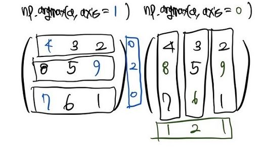
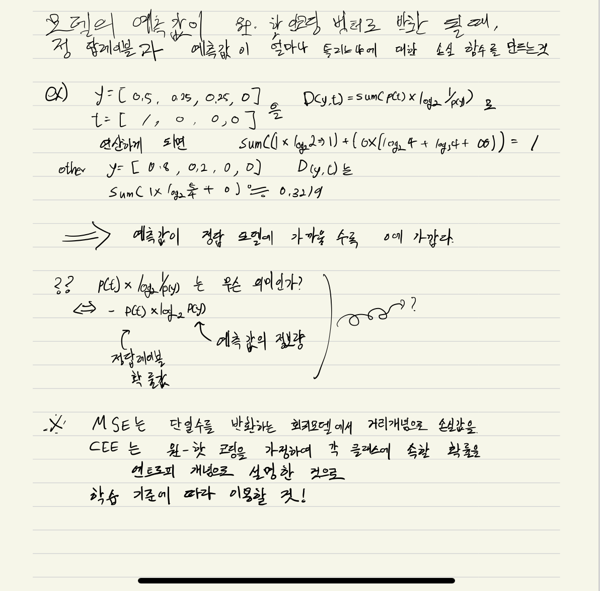

# 2층 신경망 구현하기.

## argmax 함수

행렬에서 가장 값이 높은 인덱스 번호 반환. axis = 1은 가로축, axis = 0또는 안 적으면 세로축.

## cross_entropy_error 함수 (CEE 함수)

MSE나 CEE는 대표적인 딥러닝 손실함수이다.

분류문제, 즉 범주형 데이터 예측 문제에는 CEE를 사용하는 것이 좋고, 회귀문제인 수치형 데이터 예측문제에는 MSE를 사용하는게 좋다.

MSE)
MSE는 가장 간단한 손실함수로 Mean Sqquared error이며
정답값과 예측값의 차이를 제곱후 평균 내주는 것, 즉 분산이다.

CEE)
이와 달리 CEE는 원 핫 코딩을 통해 정답값을 예측한 모델이
예측값으로 [0.2, 0.75, 0, 0.05 ]을 내놓고
정답 레이블로 t = [1, 0, 0, 0] 이 주워졌을 때,
D(y,t) = sum(p(t) * log2 1/p(y))에 따라 연산하게 된다.

예측 레이블이 정답 레이블와 일치 할수록 값이 작아진다.

CEE - MSE 결론)

 MSE는 단일수를 반환하는 회귀모델에서 거리개녕믕로 손실값을
 CEE는 원 - 핫 코딩으로 각 클래스에 속할 확률을 엔트로피 개념으로 설명한 것으로
 학습기준에 따라 적절히 이용할 것!

+) 필기

출처 : https://wiserloner.tistory.com/1083