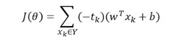
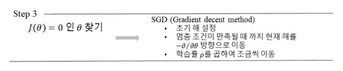
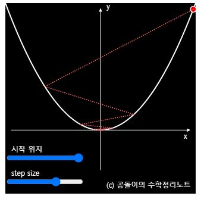
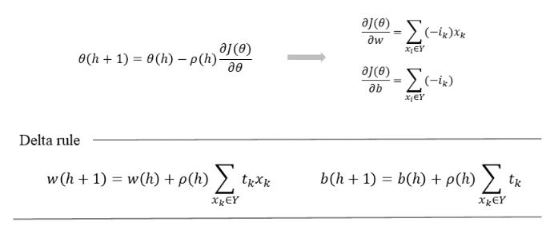
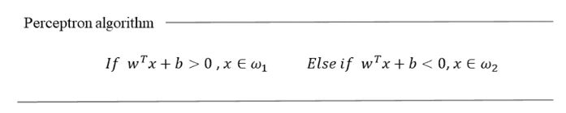

# 퍼셉트론 학습

## 1. 퍼셉트론 학습
 훈련 집합이 주어졌을 때 훈련 집합을 옳게 분류하는 퍼셉트론을 찾는 것.
  알고리즘으 다음과 같은 단계를 거친다
   1) 분류기 구조를 정의하고 분류 과정을 수학식으로 표현한다.
   2) 분류기의 품질을 측정할 수 있는 비용 함수를 정의한다.
   3) 비용 함수를 최대로 또는 최소로 하는 파라이머 세타를 찾기 위한 알고리즘을 설계한다

### 1단계
 매개변수를 퍼셉트론이 구성하는 가중치와 편향으로 정의한다.

 

### 2단계
 퍼셉트론이 발생하는 오류율을 비용함수로 정의하고 오류율이 작을수록 분류를 더 잘하고 품질이 좋은 분류기라고 할 수 있다.
  X는 샘플, Y는 오분류된 샘플들의 집합이라고 한다. 오분류된 샘플 x가 w1에 속한다면 tk = 1이고 오분륜 되었으므로 wx + b < 0 이다. 때문에 전체식은 양수가 된다. => 비용함수가 양수가 되어 오분류된 샘플의 개수가 많아지면 비용함수가 커진다.

### 3단계

비용함수를 가지고 최적의 파라미터를 찾으면 된다. 최소의 값을 찾기 위해 비용함수의 Gradient descent로 찾으면 된다.(기울기가 0이 되는 점을 찾아서 최소값 구하기? => 비선형함수 또는 닫힌 형태가 아닌 경우 기울기를 구할 수 없음, 경사하강법)

 +) 경사하강법에 대한 그림
 

 경사하강법 적용하는 예시

 

 초기해를 설정한 후 멈춤조건을 만족할 때 까지 현재 해를 기울기 -방향으로 조금씩 이동.

 최종적으로 퍼셉트론의 값이 0보다 크면 부류 w1, 값이 1보다 작으면 부류 w2라고 한다.

  

  출처 : https://ysbsb.github.io/machine_learning/2021/02/07/Perceptron.html