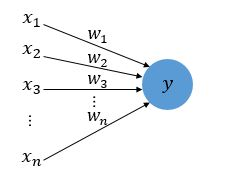
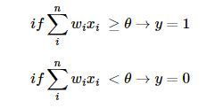
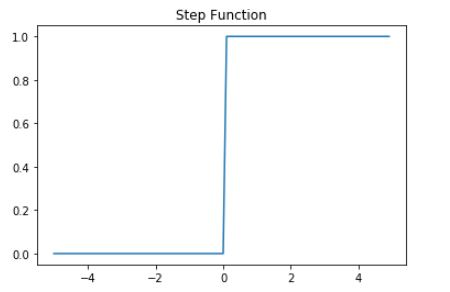
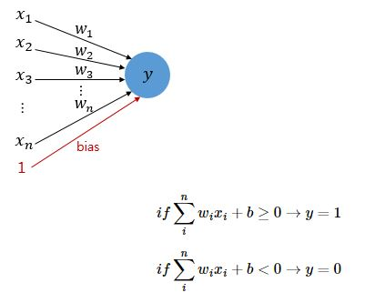
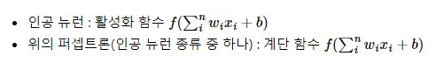
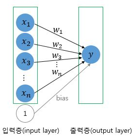
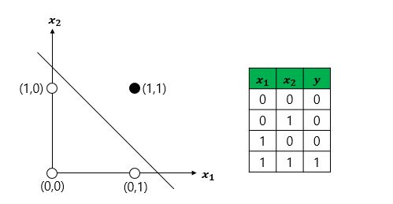
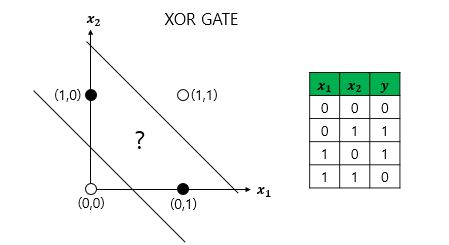
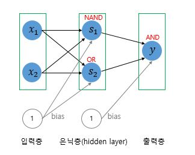

# 퍼셉트론이란?

## 1. 퍼셉트론(Perceptron)

퍼셉트론은 프랑크 로젠블라트가 1957년에 제안한 초기 형태의 인공 신경망으로 다수의 입력으로부터 하나의 결과를 내보내는 알고리즘이다.

 x는 입력값을 의미하며 w는 각 입력에 대한 가중치, y는 출력값을 의미한다.
 이때 가중치w가 클수록 입력이 중요함을 의미한다.

 각각의 입력과 가중치의 곱이 특정 값을 넘어가게 되면 출력은 1이 되며

때문에 출력은 계단함수 형태를 보인다.

더 나아가 위의 식에서 임계치 세타를 좌변으로 넘기고 편향b(bias)로 표현할 수 있다. 편향 b 또한 퍼셉트론의 입력으로 사용된다. 보통ㅇ 그림으로 표현할 때 입력값이 1로 고정되고 편향 b가 곱해지는 변수로 표현된다.

퍼셉트론의 활성화 함수와 인공 뉴런의 활성화 함수

퍼셉트론의 활성화 함수는 계단 함수이지만 계단 함수를 시그모이드 함수로 바꾸면 로지틱스 회귀와 동일하다.

## 2. 단층 퍼셉트론

 값을 보내는 층과 받아서 출력하는 두 단계로만 이루어진다.

 

활용 예시로 AND게이트가 있다. x1, x2가 모두 1일 때만 1을 출력할 수 있도록 하는 가중치와 편향의 조합은 많지만 한가지 예시를 들면 다음과 같은 코드가 있다.

def AND_gate(x1, x2):
    w1 = 0.5
    w2 = 0.5
    b = -0.7
    result = x1*w1 + x2*w2 + b
    if result <= 0:
        return 0
    else:
        return 1

이 식을 시각화 해본다면

이다.

AND 외에도 OR, NAND이 구현 가능하지만 XOR의 경우

과 같이 2개의 층이 필요함으로 단층 퍼셉트론으로는 구현이 불가능함을 알 수 있다.

## 3. 다층 퍼셉트론(MLP)

 XOR을 구현하기 위해서는 AND, NAND, OR 게이트를 조합하여 만들 수 있으며 퍼셉트론 관점에서 말하면 층을 더 쌓아 만들 수 있습니다. 이때 단층 퍼셉트론과 달리 입력, 출력층 외에 추가적인 층이 존재하게 되는데 이 층을 은닉층이라 합니다.

 

은닉층이 2개 이상인 신경망을 심층 신경망이라 합니다.

## 4. 마무리하며

단층과 다층 퍼셉트론이 사용하는데 중요한 점은 가중치와 편향을 어떻게 설정할 지 이다. 간단한 AND,OR 의 경우엔 직접찾을 수 있지만 기계가 가중치를 찾게 하는 자동화 하는 과정은 필수적이다. 이것이 훈련 또는 학습 과정이 된다. 이 과정에서 손실함수 와 옵티마이저가 사용된다.
