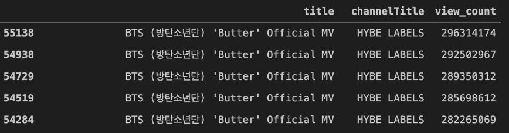
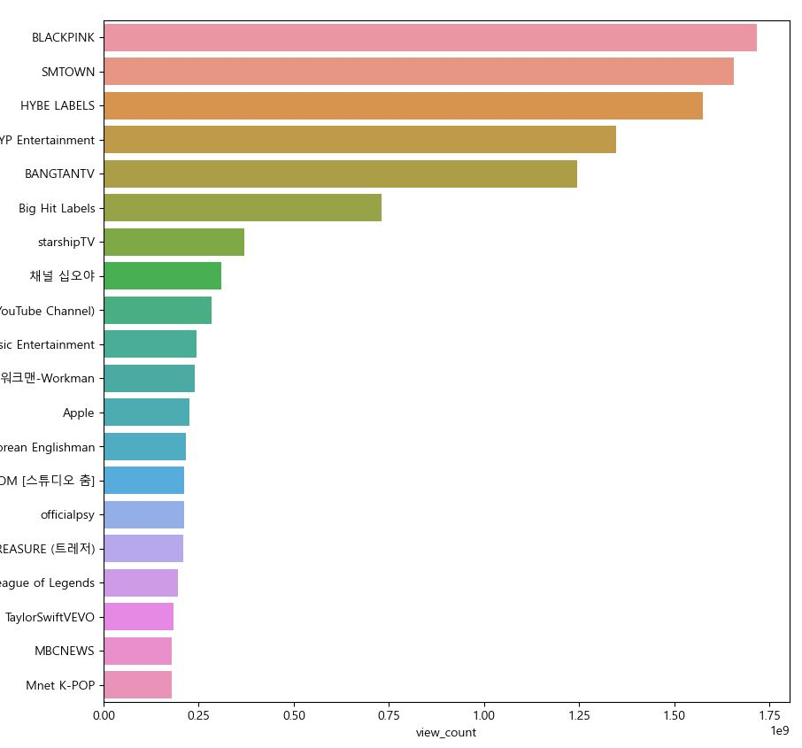

# 한국 유튜브 최다 조회수 채널 검색하기

## 1. 케글에서 데이터 가져오기

 케글 사이트 들어간 후 검색창에 youtube라고 검색하고 date에서 today라고 검색하면 조회수와 관련된 데이터를 다운 받을 수 있다. 다운받은 압축 파일에서 KR이 들어간 CSV파일만 있으면 된다.

 ## 2. 데이터 전처리
 

### 1)관련 페키지 선언

import pandas as pd              # 데이터 프레임
import numpy as numpy            # 행렬
import seaborn as sns            # 데이터 분포 시각화에 활용됨
import matplotlib.pyplot as plt  # 데이터 시각화
import os                        # Operation system 의 약자, 운영체제에서 제공되는 여러 기능을 파이썬에서 아용 할 수 있다.

### 2) Dataset 판다스로 불러오기

KRvideo = pd.read_csv("KR_youtube_trending_data.csv")

KRvideo = pd.read_csv("KR_youtube_trending_data.csv", engine="python", error_bad_lines="false")     # 옵션 추가

### 3) 데이터에 대한 이해

 KRvideo.info() # 데이터 프레임 전체의 정보 요약 확인

 df = KRvideo[["title", "channelTitle", "view_count"]] # 원하는 열만 가져와 df로 새로 정의

### 4) 조회수 내림차순 정렬

df_sorted = df.sort_values(by='view_count', ascending=False) # 뷰 카운트를 기준으로 sort(내림차순)

 BTS의 중복이 많다. 중복을 제거해 보자.

### 5) drop_duplicates을 활용해 중복 제거

 df_sorted_latest = df_sorted.drop_duplicates(['title','channelTitle'], keep='first') # title, channelTitle이 중복된 열을 순위가 높은것을 제외하고 드롭한다.

+) 추가적인 사용법

df.drop_duplicates(subset=None, keep='first', inplace=False, ignore_index=False)
subset : 중복값을 검사할 열 입니다. 기본적으로 모든 열을 검사합니다.
keep : {first / last} 중복제거를할때 남길 행입니다. first면 첫값을 남기고 last면 마지막 값을 남깁니다.
inplace : 원본을 변경할지의 여부입니다.
ignore_index : 원래 index를 무시할지 여부입니다. True일 경우 0,1,2, ... , n으로 부여됩니다.

출처 : https://wikidocs.net/154060

## 3. 인기있는 채널 20개 출력

### 1) 20개 정리

#groupby() : 특정 컬럼을 기준으로 그룹을 묶어서 평균, 합계를 낼 수 있음

#채널별 조회수 합계 계산
df_channel_view_sum = df_sorted_latest.groupby(['channelTitle']).sum()

#채널별 조회수 내림차순 정렬
df_channel_view = df_channel_view_sum.sort_values(by='view_count', ascending=False)

#총 2253개의 채널 중 상위 20개 채널만 가져오기
df_channel_view_top20 = df_channel_view[:20]

#데이터 출력
df_channel_view_top20

### 2) 시각화

 시각화를 위한 index추가. 0~99까지 인덱스가 있어야 그래프를 그릴 수 있음. ------------------***

 df_channel_view_top20_index = df_channel_view_top20.reset_index()

 #그래프 출력 시 이상한 에러들 무시
import warnings
warnings.filterwarnings("ignore")

#그래프 그릴 때 한글 깨짐 방지 설정
import os

#Mac OS의 경우와 그 외 OS의 경우로 나누어 설정

if os.name == 'posix':
    plt.rc("font", family="AppleGothic")

else:
    plt.rc("font", family="Malgun Gothic")

#그래프 사이즈 설정
plt.figure(figsize=(10,10))

#seaborn 패키지로 수평막대 그래프 그리기
sns.barplot(x='view_count', y='channelTitle', data=df_channel_view_top20_index)

### 3) 결과물

