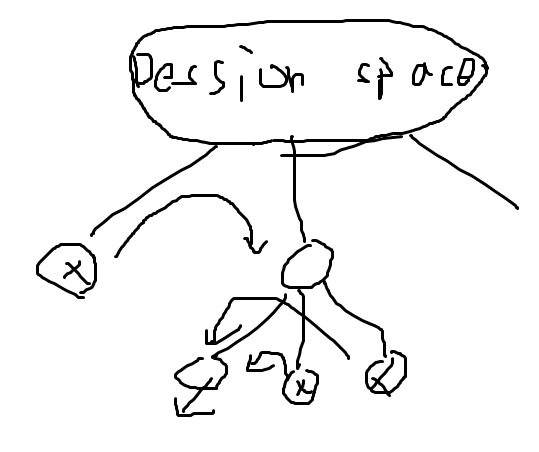

# Back Tracking

## BT와 DP, DFS 간이 차이점은??

- DP는 DP array 또는 table에 저장하며 진행하며 중복된 계산을 방지한다.

- DFS는 모든 경우의 수에 대해서 탐색한다. 때문에 미리 특정 조건을 정해두지 않는다면 런타임이 늘어나게 된다.

- BackTracking는 Dession Space 기준으로 여러 후보들 중 정답의 조건에 만족하지 않는다면 더 이상 탐색하지 않고 Dession Sapce로 돌아가 다른 후보를 탐색한다.
  - 이 때, 조건을 만족하는 지점에서 다시 Dession Space를 만든다.

 